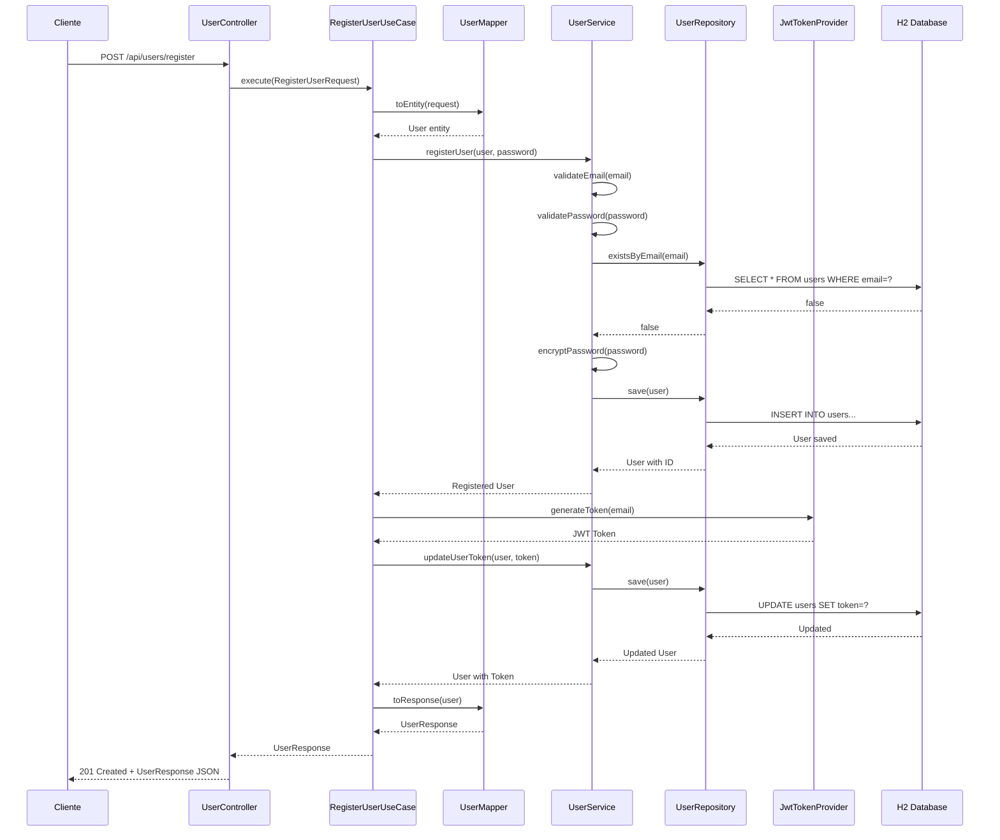
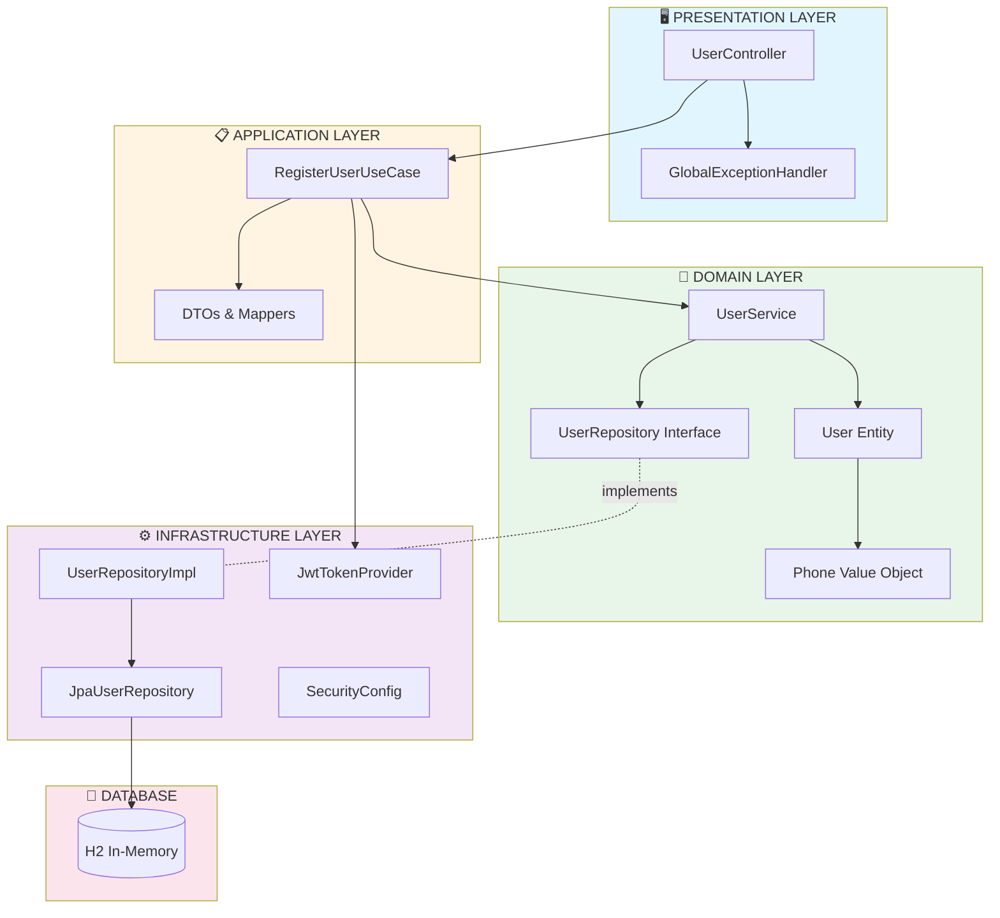
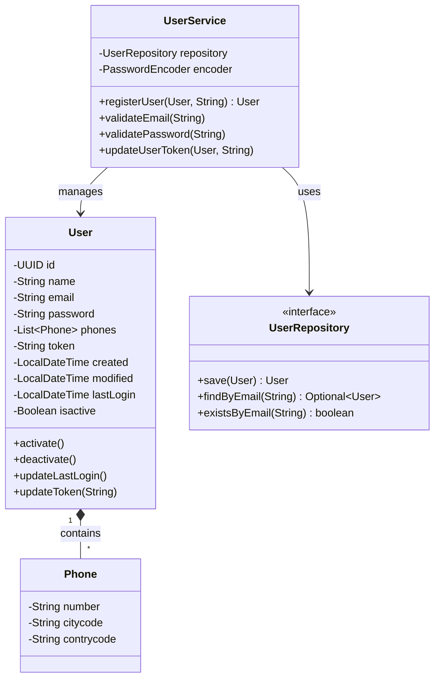

# Diagrama de Arquitectura

## Flujo de Registro de Usuario



## Capas DDD



## Patrones de Diseño

```mermaid
mindmap
  root((Patrones de Diseño))
    Creacionales
      Factory Pattern
        JwtTokenProvider
      Builder Pattern
        User.builder()
        DTOs builders
      Singleton Pattern
        Spring Beans
    Estructurales
      Adapter Pattern
        UserRepositoryImpl
      DTO Pattern
        RegisterUserRequest
        UserResponse
      Mapper Pattern
        UserMapper
    Comportamiento
      Strategy Pattern
        Email Validation
        Password Validation
        PasswordEncoder
      Repository Pattern
        UserRepository
      Service Pattern
        UserService
      Use Case Pattern
        RegisterUserUseCase
```

## Modelo de Dominio


